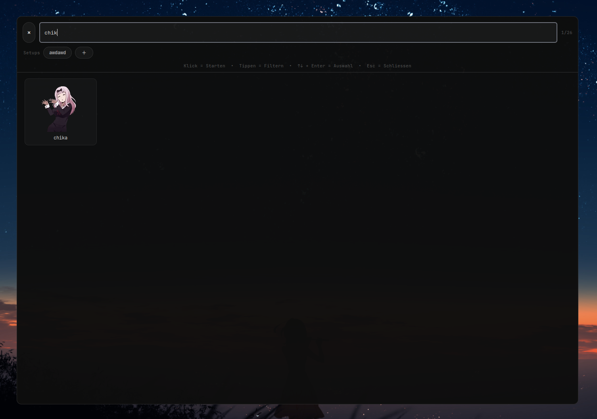

<p align="center">
  
</p>

<h1 align="center">GIF Player</h1>

<p align="center">
  <strong>Animated GTK3 GIF overlays for Wayland</strong>
</p>

<p align="center">
  NixOS first · Arch Linux · Fedora
</p>

GIF Player displays animated GIFs as lightweight desktop overlays on Wayland.
It uses GTK3 and GtkLayerShell, while one supervisor daemon manages every
running widget through a JSON Unix-socket protocol.

The player supports multiple instances of the same GIF, saved profiles, free
positioning, drag and lock modes, scaling, opacity, playback speed, flipping,
bounce movement and animated jumps. GIF frames are decoded with Pillow and
rendered through Cairo.

> **Display requirement:** GIF Player requires a Wayland session and a
> compositor with layer-shell support, such as Niri, Sway, Hyprland or
> Wayfire. X11 and GTK4 are not supported.

GIF files are not bundled with the project. Use your own local GIF collection.

## Preview

<table>
  <tr>
    <td width="50%" align="center">
      
      <br>
      <sub><strong>GIF Picker</strong> — browse and launch GIFs from your configured collection.</sub>
    </td>
    <td width="50%" align="center">
      
      <br>
      <sub><strong>In action</strong> — independent animated overlays running directly on the desktop.</sub>
    </td>
  </tr>
</table>

## Features

- Graphical GIF picker and live control panel
- Multiple independent widgets and duplicate GIF instances
- Move, scale, flip, pause, lock, bounce and jump controls
- Persistent positions, settings and reusable profiles
- Smooth frame pacing with shared decoded frames
- Multi-monitor support and unrestricted off-screen positioning
- XDG-compliant configuration, cache and runtime paths
- CLI, desktop entries and Fish shell completions
- Packages for Nix, Arch Linux and Fedora

## Installation

### Nix

Install the package into your current profile:

```console
nix profile add github:xnixjoyer/GIF-Player
```

Run it directly without installing:

```console
nix run github:xnixjoyer/GIF-Player -- --help
nix run github:xnixjoyer/GIF-Player -- mascot
```

The flake supports `x86_64-linux` and `aarch64-linux` and provides packages,
apps, checks and a development shell.

For a NixOS flake, add the input and package:

```nix
{
  inputs.gif-player.url = "github:xnixjoyer/GIF-Player";

  outputs = { nixpkgs, gif-player, ... }@inputs: {
    nixosConfigurations.your-host = nixpkgs.lib.nixosSystem {
      specialArgs = { inherit inputs; };
      modules = [
        ({ pkgs, ... }: {
          environment.systemPackages = [
            gif-player.packages.${pkgs.system}.default
          ];
        })
      ];
    };
  };
}
```

### Arch Linux

Build the included package recipe:

```console
git clone https://github.com/xnixjoyer/GIF-Player.git
cd GIF-Player/packaging/arch
makepkg --syncdeps --cleanbuild
sudo pacman -U gif-player-*.pkg.tar.zst
```

### Fedora

Build the included RPM recipe from the repository root:

```console
sudo dnf install rpm-build python3-devel pyproject-rpm-macros \
  python3-setuptools python3-wheel desktop-file-utils \
  python3-gobject python3-cairo python3-pillow gtk3 gtk-layer-shell \
  gobject-introspection

mkdir -p ~/rpmbuild/{SOURCES,SPECS}
tar --exclude-vcs --exclude='./dist' --exclude='./build' \
  --transform 's,^,gif-player-0.3.0/,' \
  -czf ~/rpmbuild/SOURCES/gif-player-0.3.0.tar.gz .
cp packaging/fedora/gif-player.spec ~/rpmbuild/SPECS/
rpmbuild -ba ~/rpmbuild/SPECS/gif-player.spec
sudo dnf install ~/rpmbuild/RPMS/noarch/gif-player-*.noarch.rpm
```

More packaging details are available in [PACKAGING.md](PACKAGING.md).

## Quick start

Place one or more GIF files in the default data directory:

```console
mkdir -p ~/.local/share/gif-player/gifs
cp ~/Pictures/mascot.gif ~/.local/share/gif-player/gifs/
```

Open the graphical picker:

```console
gif-player
```

Or launch a GIF directly by filename or path:

```console
gif-player mascot
gif-player run ~/Pictures/mascot.gif
gif-player run ~/Pictures/mascot.gif --monitor 1
```

The daemon starts automatically when a GIF is launched. Starting the same GIF
again creates another instance with its own widget ID.

## Programs

| Program | Description |
|---|---|
| `gif-player` | Main CLI, picker launcher and daemon bootstrap |
| `gif-picker` | Graphical browser for the configured GIF directory |
| `gif-control` | Graphical control panel for active widgets |
| `gif` | Optional Fish function forwarding to `gif-player` |

## Command reference

| Command | Description |
|---|---|
| `gif-player` | Open the graphical picker |
| `gif-player NAME` | Start a GIF by unique filename stem |
| `gif-player run GIF` | Start a GIF by name or path |
| `gif-player list` | List active widget IDs |
| `gif-player picker` | Open the graphical picker |
| `gif-player control` | Open the live control panel |
| `gif-player edit` | Unlock all widgets for editing |
| `gif-player lock` | Lock all widgets and enable click-through |
| `gif-player ipc ID ACTION` | Send an action to one widget |
| `gif-player all ACTION` | Send an action to every widget |
| `gif-player stop-all` | Close every active widget |
| `gif-player doctor` | Check Python, GTK and typelib dependencies |
| `gif-player self-test` | Print resolved paths and runtime information |

Run `gif-player --help` for the complete CLI syntax.

### Widget actions

Available actions include:

```text
status lock unlock toggle pause play
move X Y           move-by DX DY
scale N            corner POSITION
opacity N          flip MODE
speed N            bounce
stop-bounce        hop
jump               jump-rate SECONDS
reset              quit
```

Examples:

```console
# Start two independent instances
gif-player mascot
gif-player mascot

# Inspect their generated IDs
gif-player list

# Control one widget
gif-player ipc mascot-2 move 300 120
gif-player ipc mascot-2 scale 1.4
gif-player ipc mascot-2 opacity 0.8
gif-player ipc mascot-2 speed 1.25
gif-player ipc mascot-2 flip horizontal
gif-player ipc mascot-2 bounce

# Control every widget
gif-player all pause
gif-player all play
gif-player all lock

gif-player stop-all
```

## GIF directory and configuration

GIF directory priority:

1. `--gif-dir DIR`
2. `GIF_PLAYER_GIF_DIR`
3. `$XDG_DATA_HOME/gif-player/gifs`
4. `~/.local/share/gif-player/gifs` when `XDG_DATA_HOME` is unset

Example with a custom collection:

```console
export GIF_PLAYER_GIF_DIR="$HOME/Pictures/Gifs"
gif-player
```

The directory can also be selected for one command only:

```console
gif-player --gif-dir ~/Pictures/Gifs mascot
```

GIFs may be stored in subdirectories. A unique filename stem can be used
without the `.gif` extension. When several files have the same stem, the CLI
reports the ambiguity instead of launching an arbitrary file.

An existing legacy directory at `~/Scripts/Gif-Overlay/Gifs` is recognized as
a compatibility fallback when the XDG GIF directory does not exist. GIF Player
never creates that legacy path.

## XDG paths

| Data | Default location |
|---|---|
| GIF collection | `$XDG_DATA_HOME/gif-player/gifs/` |
| State | `$XDG_CONFIG_HOME/gif-player/state.json` |
| Profiles | `$XDG_CONFIG_HOME/gif-player/profiles.json` |
| Thumbnail cache | `$XDG_CACHE_HOME/gif-player/thumbs/` |
| Socket, lock and daemon log | `$XDG_RUNTIME_DIR/gif-player/` |
| Runtime fallback | `/tmp/gif-player-$UID/` |

The runtime directory is private with mode `0700`, and the Unix socket uses at
most `0600`. User configuration, GIFs, profiles, caches and logs are never
written into the Nix store or bundled into distribution packages.

## Positioning and recovery

Manual positions are not clamped to monitor boundaries. Negative coordinates
and positions beyond the right or bottom edge are valid:

```console
gif-player ipc mascot move -250 900
gif-player ipc mascot move 3000 -400
```

A partially or completely off-screen widget keeps its exact position when it
is locked. Recover an invisible widget with one of these commands:

```console
gif-player ipc mascot corner center
gif-player ipc mascot reset
gif-player ipc mascot move 100 100
```

## Troubleshooting

Check installed dependencies and resolved paths:

```console
gif-player doctor
gif-player self-test
```

Read the daemon log:

```console
cat "$XDG_RUNTIME_DIR/gif-player/daemon.log"
```

Common problems:

- `WAYLAND_DISPLAY is not set`: run GIF Player inside a graphical Wayland session.
- No overlay appears: verify that the compositor supports layer-shell.
- A GIF cannot be found: check the resolved `gif_dir` with `gif-player self-test`.
- The picker cannot reach the daemon: inspect `daemon.log` for the startup error.
- A widget is invisible: use `corner center`, `reset` or an explicit position.
- After updating the package: run `gif-player stop-all` before starting it again.

Detailed timing diagnostics can be enabled manually:

```console
gif-player stop-all
GIF_PLAYER_DEBUG_TIMING=1 gif-player daemon
```

This records frame deadlines, surface transitions, jump progress, draw events
and frame catch-up behavior in the daemon log.

## Development

```console
nix develop
python gif_player_cli.py --help
python -m unittest discover -s tests -v
ruff check .
nixfmt flake.nix nix/package.nix
nix flake check
nix build .#gif-player
./result/bin/gif-player --help
```

The automated checks cover Python syntax, GTK typelibs, isolated XDG paths,
runtime permissions, protocol-v2 round trips, GIF name resolution, frame
disposal, Cairo pixel conversion, jump continuity, unrestricted positions,
bounce reflection and absolute frame deadlines. Display-free checks do not
open a real Wayland window.

For implementation details, see [ARCHITECTURE.md](ARCHITECTURE.md) and the
[player pipeline analysis](docs/PLAYER_PIPELINE_ANALYSIS.md).

## License

GIF Player is independently written software licensed under the
[GNU General Public License v3.0 or later](LICENSE).

The repository does not include GIFs, anime media or other third-party content.
Files supplied by users remain subject to their respective copyrights and
licenses.
